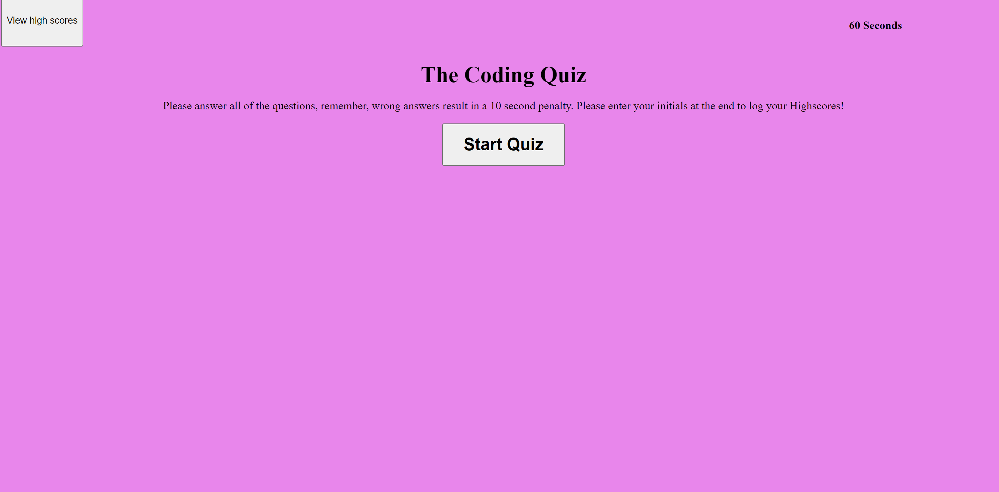

# code-quiz-id

## Decription

This is a coding quiz application which allows the user to take a five question, multiple choice quiz. Once you click the start button you have 75 seconds to complete the quiz. If you get a question wrong it decreases your time by 10 seconds. Once you have concluded the quiz you can log your initials to keep track of your high scores!

## Screenshot

## Usage

This is a responsive application that is compatible with most devices, click the link provided and enjoy!

## Link

Here is the link to the GitHub pages: https://isaackice.github.io/code-quiz-id/

## Credits

Professor Joe Han 
Teachers Assistant Manolis Koutouzos 
Teachers Assistant Paul Cwik 
Classmate Jonathan Plaras 
Classmate Eric Kirberger 
Classmate Valentina Guevara 
W3schools 
Bootstrap 
JQuery

## License

MIT License // Refer to repository

